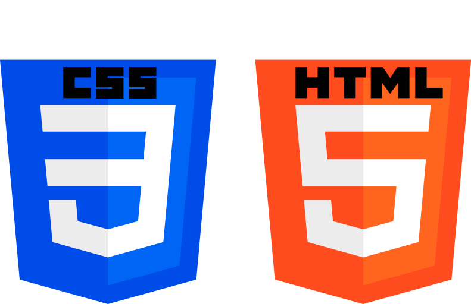

# CSS_cardANDbutton

## Программы
- **Visual Studio Code**
## Актуальность
С помощью формального языка CSS можно создавать интересные решения для ваших сайтов, они повысят оригинальность и привлекательность ваших проектов.

 
<i>Используемые языки стилей и разметок</i>

  

## Создание модели зарядного устройства

Как и любой объект модель началась с куба, в последствие были экструдированы высоты и появились очертания блока зарядки, с помощью команды Bevel были скруглены углы. В дальнейшем мы создали BezierCircle, увеличили его толщину чтобы он был похож на провод. Нам осталось сделать Type-C, где мы из прямоугольника с помощью команды Boolean вычитаем закругленный прямоугольник, чтобы сделать этот разъём. В конечном итоге нам осталось наложить материалы и сделать круговую камеру для более призентабельного вида.

 
<i>Зарядное устройство Type-C</i>

### Контакты
* Смоделировал: <a href="https://vk.com/doobada">Артём Богданов</a>
