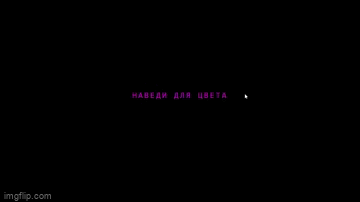
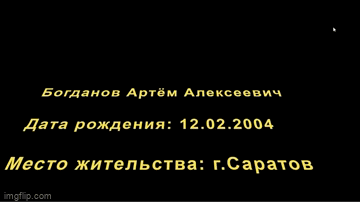

# CSS_Project

## Программы
- **Visual Studio Code**
## Актуальность
С помощью языка стилей CSS и языка разметки HTML можно создавать интересные решения для ваших сайтов, они повысят оригинальность и привлекательность ваших проектов.

 
<i>Используемые языки стилей и разметок</i>

  

## Создание карточки

Как и во всех проектах мы создаем файлы index.html и style.css. После того как мы связали эти файлы в index.html мы создаем несколько классов, **wrap** - главный фон нашего проекта; **card** - размер карточки; **front** - стиль для передней части карты; **back** - стиль для задней части карты. Именно в классе **back** - стоит анимация переворачивания и наложена картинка. В конце используется псевдокласс **:hover** - срабатывает, когда пользователь наводит на элемент мышью, но не обязательно активирует его.

 
<i>Пример работы карточки</i>

## Создание кнопки

С помощью строкового контейнера  мы создадим неоновые линии вокруг кнопки. Класс **а** задает размеры нашей кнопки, **a:hover** - при наведении мышки накладывает тени и меняет цвет надписи. Теперь для  указываем его разположение и анимацию.

 
<i>Пример работы кнопки</i>

## Создание титров как в Star Wars 
  
В данной работе использовались все ранее приобретенные навыки и новое правило **@keyframes** оно устанавливает ключевые кадры при анимации элемента. Ключевой кадр это свойства элемента (прозрачность, цвет, положение и др.), которые должно применяться к элементу в заданный момент времени.
  

 
<i>Пример работы титров</i>

  
## Вывод

Данные проекты помогли мне познакомится с языком разметки HTML и языком стилей CSS, теперь я могу на базе этих знаний создавать для своих сайтов интересные визуальные решения.

### Контакты
* VK: <a href="https://vk.com/doobada">Артём Богданов</a>
* mail: bogdanov200412@gmail.com
